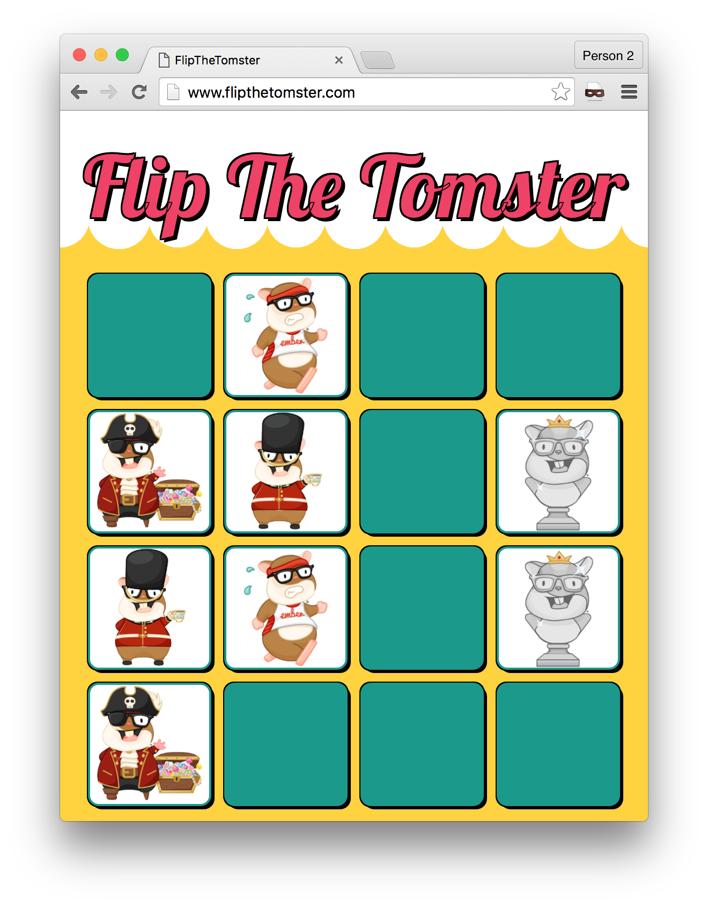

# Flip The Tomster

Flip cards game featuring Tomster's 100 different faces. A small Ember.js game written originally for the [Ember Montevideo Meetup](https://www.meetup.com/ember-montevideo).

Now maintained by the awesome [MVDWG :elephant:](https://github.com/mvdwg) team.



## Contributing

You can propose features and report issues in [Github's issue tracker](https://github.com/mvdwg/flip-the-tomster/issues).

## Development

```sh
$ git clone https://github.com/mvdwg/flip-the-tomster.git
$ cd flip-the-tomster
$ npm install
$ bower install
$ ember serve
```

And then visit [http://localhost:4200](http://localhost:4200).

### Project's health

[](https://circleci.com/gh/mvdwg/flip-the-tomster)

## License

flip-the-tomster is licensed under the MIT license.

Tomster is a registered and protected trademark by [TILDE INC.](http://www.tilde.io).

See [LICENSE](./LICENSE.md) for the full license text.
